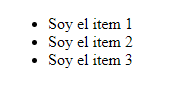
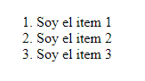

# HTML: aprende lo básico

HTML (HyperText Markup Language) es un lenguaje de marcado de hipertexto, sería como los cimientos de una casa en construcción, mientras que CSS sería los estilos como la pintura, los cuadros, etc.

HTML consiste en crear elementos los cuales le dicen al navegador como tiene que mostrar su contenido.


## ¿Cómo es un elemento HTML?

Un elemento HTML está definido asi: `<etiqueta de apertura o inicio>` contenido `</etiqueta de cierre>`


> Imagen tomada de [Mozilla Developer (MDN)](https://developer.mozilla.org/es/).

El elemento sería la etiqueta de apertura, seguida del contenido, seguida de la etiqueta de cierre.
El elemento que acabamos de ver mostraria esto: 

```p
  My cat is very grumpy
```

Con los estilos que tiene por defecto los elementos `<p>`.

Los elementos se pueden meter dentro de otros elementos html, esto se llama anidamiento.

```p
  <p>Mi gato es <strong>muy</strong> gruñón.</p>
```
Esto mostraria la palabra MUY en un texto más fuerte y diferenciado de las otras palabras.


## Estructura básica de un documento HTML:

Un documento HTML básico se estructura así:

```html
<!DOCTYPE html>
<html>
  <head>
    <title>Título de la página</title>
  </head>
  <body>
    <!-- Contenido visible de la página -->
  </body>
</html>
```

Y asi funcionan las etiquetas que estan en el código de arriba:

`<html></html>`: Es el elemento raíz de la página web o documento HTML.

`<head></head>`: Contiene información o metadatos sobre la página HTML, lo que ingreses acá no se verá en el contenido de la página web.

`<body></body>`: Contiene todo el contenido visible de la página.

`<!DOCTYPE html>`:  Declara el tipo de documento y la versión de HTML.

`<title>`: Pone el título de la página, se muestra en la barra de título del navegador o en la pestaña de la página y ayuda a los motores de busqueda a encotrar la página.


## Etiquetas más comúnes:

`<h1>`: Es el título del contenido visible, solo se puede poner uno por documento HTML.

`<h2>,<h3>,<h4>,<h5>,<h6>`: Son los encabezados de la página, mientras más grande es el numero menos importancia tiene el texto, y los estilos por defecto son más chicos.

`<p>`: Se usa para definir un párrafo de texto.

``: Con esta etiqueta se ponen las imágenes en la web.

`<audio>`: Con esta etiqueta se puede poner audios en la web.

`<video>`: Con esta etiqueta se puede poner videos.

`<a>`: Se utiliza para crear enlaces, que pueden llevar a los usuarios a otras páginas web, a diferentes secciones de la misma página, a archivos para descargar, o a otros recursos. La a significa "anchor" (ancla en inglés).

`<ul>`: Define una lista desordenada.

`<ol>`: Define una lista ordenada numericamente

`<li>`: Define un ítem de la lista.

`<hr>`: Crea una línea que sirve para separar elementos o tematicas de la página.

`<br>`: Hace un salto de línea.

## Etiquetas que se usan para estructurar la página web:

`<div>`: Define una división o sección en un documento (bloque), generalmente se usa para dar estilos.

`<span>`: Define una sección en línea dentro de un documento.

`<header>`: Define el encabezado de la página web, generalmente es un contenedor introductorio o un conjunto de enlaces de navegación.

`<footer>`: Es el pie de la página web, generalmente se pone el nombre del que hizo la página o que tiene los derechos reservados.

`<nav>`: Define la navegación de la página web.

`<section>`: Define una sección en el documento html.

`<article>`: Define un articulo autonomo o independiente, generalmente puede incluir artículos de noticias, publicaciones de blog, entradas de foro, comentarios de usuarios, productos de una tienda, etc.

`<aside>`: Define algún contenido aparte del contenido en el que se coloca. El contenido aparte debe estar indirectamente relacionado con el contenido que lo rodea, generalmente se coloca en una barra lateral.

`<main>`: Define el contenido más importante de la página web, al igual que el h1, se puede tener uno solo por documento HTML.


## Atributos

Un elemento HTML puede tener atributos, los atributos se ven asi:


> Imagen tomada de [Mozilla Developer (MDN)](https://developer.mozilla.org/es/).

Los atributos tienen información adicional sobre el elemento, esta información no se mostrará en pantalla.


## Un atributo debería tener:


- Un espacio entre él y el nombre del elemento. (Para un elemento con más de un atributo, los atributos también deben estar separados por espacios).
- El nombre del atributo, seguido de un signo igual.
- Un valor de atributo, envuelto con comillas de apertura y cierre.


## Etiqueta de hipervínculos:
`<a>`: La etiqueta `<a>` nos va a permitir navegar hacia otras páginas o movernos por diferentes sitios de nuestra web.

Por ejemplo:
```html
<a href="https://www.ejemplo.com" target="_blank">Visitar Ejemplo</a>
```

- **`href`**: Define el destino del enlace.
- **`target`**: Define cómo se abre el enlace (e.g., en una nueva pestaña).

## Comentarios
Los comentarios en HTML son asi:
`<!-- <p> ¡Contenido! </p> -->`
Lo que pongamos dentro de `<!--  -->` no se va a mostrar a los usuarios, sirve para dejar mensajes o recordatorios.

## ¿En HTML se usa comillas simples ('') o dobles ("") ?
LAS DOS, depende de cual te guste más, pero siempre es importante que si arrancan con una por ejemplo la " termines con esa misma ". Porque si empezas con una y terminas con otra va a salir un error.

## Etiqueta ``

Con la etiqueta `` podemos mostrar imágenes al usuario en la página web.

```html

```

- **`src (Source) `**: Especifica la URL de la imagen que deseas mostrar. Por ejemplo, src="imagen.jpg" indica la ubicación del archivo de imagen.
- **`alt: (Alternative Text)`**: Proporciona una descripción alternativa de la imagen. Este texto se muestra si la imagen no puede ser cargada y también ayuda a los lectores de pantalla a describir la imagen a los usuarios con discapacidades visuales.

- **`width`**: Le decimos cuanto queremos que tenga de ancho nuestra imágen. por ejemplo: 100px

- **`height`**: Le decimos cuanto queremos que tenga de alto nuestra imágen. por ejemplo: 200px.


## Indentación
La indentación es los espacios que se le dejan a la etiqueta que va dentro de otra etiqueta, pueden ser 2 espacios o 4, se usa esto para que el codigo HTML quede más ordenado.

```div
<div>
----<p>Contenido</p>
</div>
```
Los 4 guiones (-) seria la indentación, también se puede usar el Tab.


## Listas
Como ya vimos arriba, las etiquetas `<ul>` y `<ol>` generan listas, la etiqueta `<ul>` genera una lista desordenada, mientras que la `<ol>` genera una lista ordenada numericamente.

Dentro de estas 2 listas, tenemos la etiqueta `<li>`, que define un item de la lista. vamos a ver los ejemplos:

`<ul>`: Lista desordenada:

```ul
<ul>
    <li>Soy el item 1</li>
    <li>Soy el item 2</li>
    <li>Soy el item 3</li>
</ul>
```
resultado:




`<ol>`: Lista ordenada

```ol
<ol>
    <li>Soy el item 1</li>
    <li>Soy el item 2</li>
    <li>Soy el item 3</li>
</ol>
```
resultado:



En el archivo index.html, van a encontrar una página HTML, le puse lo básico de HTML que vimos acá. ☺️

## Páginas que me sirvieron: 

- [Mozilla Developer (MDN)](https://developer.mozilla.org/es/docs/Learn/HTML/Introduction_to_HTML/Getting_started) 
- [w3schools](https://www.w3schools.com/html/html_intro.asp) 

Todas las fotos son de Mozilla Developer (MDN), a medida que iba aprendiendo las iba sacando de ahí, les dejo el link para que visiten esa página y muchas cosas de lo que tienen: [Mozilla Developer (MDN)](https://developer.mozilla.org/es/) 
